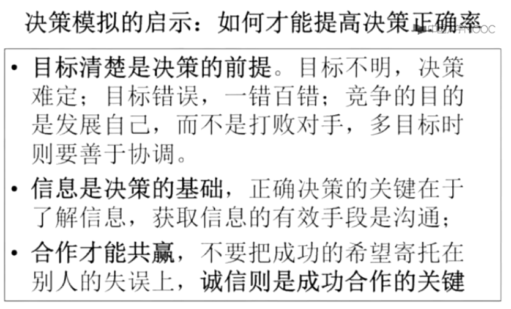
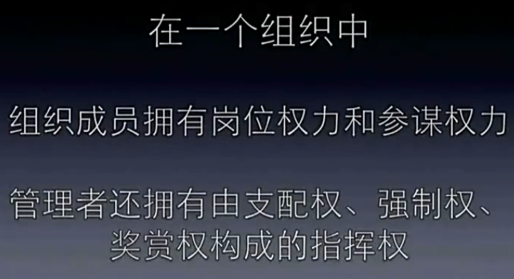
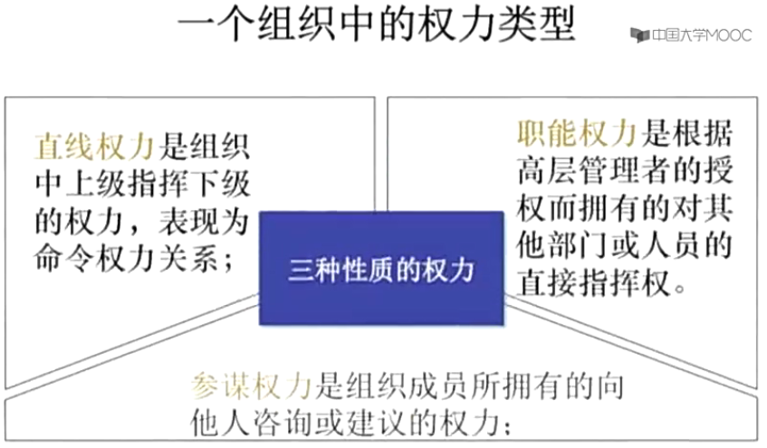

# 管理概论

视频来源：学习强国APP ， 授课老师：刑以群（浙江大学）

# 第一章 管理导论

## 1. 为什么理论和实践相差甚远？

因为理论是有使用前提的，所以，我们在应用理论的时候，必须要搞清楚这个理论的应用前提。

理论走在当下大多数实践的前面，所以，我们应该重视理论学习。

## 2. 如何学习管理？

1.  管理学是一门应用理论课。管理学是科学，管理活动是艺术。

    \--\> 依据管理学理论，以目标导向，根据实际情况实施管理活动

2.  管理学的学习方法是**读经书、交高人、勤实践、善思考**。

## 3. 管理是什么？

1. 管理工作的核心就是协调各对象的关系

2. 为什么需要管理？

因为存在人的欲望无限和资源有限的矛盾，所以，需要协调，需要管理。

3.  个人的价值由自己决定，要学会证明自己的价值。

## 4. "效率+效益"来衡量管理有效性

1.  前提条件：做对的事，即"效益"是第一位

### 面对一件事情的思维方式

1.  先了解这是一件什么事 \<\-- 询问

2.  这件事情是否需要解决? \<\-- 价值取向和目标定位

3.  谁来做？ \<\-- 角色定位和职责分工

4.  什么时候做？ \<\-- 紧急重要程度 \--\> 要事优先：紧急 \< 重要

5.  怎么做？能不能做？ \--\> 计划制定和评审

### 如何进行有效管理

1\. 计划

2\. 组织：合理的分工和协作

3\. 领导：指导、协调、激励

4\. 控制：检查、监督、纠偏

## 5. 管理的实质

1.  管理不是目的，而是一种手段、一种工具

    \--\> 不要为了管理而管理，要基于组织目标进行

### 规章制度如何执行

1\. 了解规章制度是什么？

规则制度是一种有效的管理手段，一种行为规范

2\. 组织中为什么需要规则制度？

提高效率、体现价值取向和目标要求、把事情做对

3\. 规章制度能否违反？

- 一般情况下，有章要循，但需以目标为导向，不断完善。

- 如何界定特殊情况：

  特殊范围：目标一致，或者 规章失效

  酌情处理：**目标有利原则** \--\> 不能违背或不利目标

注意避免主观判断失误，设置前提：情况紧急 且 条件确定 且 后果自负 \--\>
无法判断时，请示领导

### 管理者的思维方式

{width="4.5993055555555555in"
height="2.1444444444444444in"}

1. 具体问题具体分析，要对管理报以敬畏之心。从分析"这是一件什么事"、"这是一个什么人"、"这是一个怎样的组织"入手。
2. 破处非此即彼的思维方式，建立兼容并举的思维方式。 \--\> 从"很难说"开始

3.  责任在我，从我做起

# 第二章 组织管理

## 1. 什么是组织？

1.  由大于两人组成

2.  有一个共同的目标

3.  组织结构：角色分工、规章制度、职位职权体系

    {width="4.0159722222222225in"
    height="1.8527777777777779in"}

    {width="4.217361111111111in"
    height="2.1458333333333335in"}

## 2. 为什么要建立组织？

为了克服个人力量的局限性，实现靠个人力量无法实现或难以有效实现的目标。

\--\> 一个人可以完成的事情，不要建立组织，会降低效率。

## 3. 组织运行的机制

{width="5.378472222222222in"
height="1.117361111111111in"}

{width="3.970833333333333in"
height="2.25in"}

## 4. 组织和个人的关系
-------------------

{width="5.763888888888889in"
height="3.26875in"}

1\. 将个人目标与组织目标相关联。 \--\>
不要单以上级满意度为评判标准，容易造成个体恶性竞争关系，而应该通过构建利益共同体，将个人目标与组织目标相关联。

2\. 组织的实质是一个利益共同体。

## 5. 合格的组织成员的特征
-----------------------

1.  认同组织理念、遵循组织规范

2.  对工作结果负责，而不要只对工作过程负责。

3.  应承担起自己的责任

4.  不仅做好本职工作，还要有协作意识。

## 6. 优秀组织成员的特征
---------------------

1.  主动性 \--\> 靠前定位，主动思考，主动做事

2.  责任心 \--\> 勇于主动承担责任

3.  全局观

    1.  从组织整体角度来定位本职工作 \--\>
        why？为什么组织中设置这个岗位，为什么需要我？

    2.  善用组织的整体资源来做好本职工作。 \<\-- 个人的力量有限

    3.  通过为公的服务获得私利的满足。 \<\--
        知道通过什么方式可以得到"不能要"的东西

## 7. 影响组织绩效的主要因素
-------------------------

{width="5.760416666666667in"
height="3.259027777777778in"}

任务环境因素：凡是存在于组织外部、直接影响组织绩效的因素，都属于任务环节因素。

**从企业长远来看，真正发生作用的因素是内部因素。**

一个因素是不是管理环境因素，是怎样的环境因素，取决于该组织的目标定位。

### 1. 外部环境因素

1\. 政治因素

管理者应该提高政治敏感性，要从党政方针、国家战略解读政治对组织业绩的影响。

（1）政治体制 \--\> 执政党的路线方针 \--\> 政府对各类组织或活动的态度
\--\> 组织可以做什么，可做到何种程度

（2）政治形势 \--\> 政治力量对比 \--\> 该地区政局稳定性 \--\>
风险和不稳定性大小

2\. 经济因素

（1）可获得的资源及其成本高低

（2）需求品种、数量和价格可承受力

3\. 社会因素

（1）可获得的劳动力数量和质量

（2）所需商品和服务的数量和类型

4\. 技术因素：生产力三要素和经营方式。

5\. 任务环境因素

{width="5.756944444444445in"
height="3.2743055555555554in"}

地理环境因素

### 2. 内部环境因素

{width="5.7659722222222225in"
height="3.5555555555555554in"}

- 资源和能力的区别？资源通常是静态的，能力是依附于主体的，只有用的时候才能体现。

- 资源在于发现，可以通过联合来进行借力。 \--\> 创造条件改变

- 企业文化，由内向外

{width="5.764583333333333in"
height="3.3743055555555554in"}

{width="4.488194444444445in"
height="2.397222222222222in"}

{width="4.682638888888889in"
height="2.85in"}

{width="4.701388888888889in"
height="2.9194444444444443in"}

{width="4.647916666666666in"
height="3.0479166666666666in"}

{width="4.656944444444444in"
height="2.401388888888889in"}

## 第三章 管理者的职责及其素质

### 1. 哪些人是管理者

{width="4.566666666666666in"
height="2.295138888888889in"}

### 2. 管理者职责

1.  高层管理者的职责：对组织全责。注重负责创造环境和重大问题决策。

2.  中层管理者的职责（有被去掉的趋势）：承上启下。根据上级指示，指挥基层管理者创造性开展工作。

3.  基础管理者：直接监督现场作业人员，保证完成任务。主要关注效率的提升。

    {width="4.652777777777778in"
    height="2.359027777777778in"}

### 3.  管理者角色定位

1. 照成管理混乱的原因？

    管理错位。

    {width="4.391666666666667in"
    height="1.4305555555555556in"}

2. 当你作为基层，认为上级的指示不正确时，怎么办？

（1）  意识：
- 你认为领导不对的，也许是你自己不理解。
- 职权对等：谁下令，谁负责；下属拒不执行的，下属负责。
- 基于对组织利益的关心，你有质疑和建议权。

（2）具体做法：按照职权对等的方式处理，注意沟通技巧，提出你的建议，但如果上级不认可，须执行上级指示。

{width="3.9583333333333335in" height="0.6541666666666667in"}

3.  作为高层管理，你发现基层管理的违规作业，如何处理？

    第一，不管在什么场合，必须组织；第二，但不直接处理基层，电话让其上级到现场，处理其上级。

    **注意：不予阻止就是默写，高层管理者的言行举止都是一种行为导向。**

4.  高层管理者，对下级提出具体的操作建议？

    第一，指出问题，但不涉及具体操作个数：不符合XX规范；第二，提出要求：在XXX时间内，必须按照XXX规范整改完成。

    好处：其会按照XX规范完整梳理一次，避免了漏洞发生。

### 4. 管理者的权利

管理者的指挥权，由支配权、强制权、奖赏权构成。

1.  支配权：下级必须服从。

2.  强制权：适用于下属不履行命令时，通过威胁迫使下属服从。让下属**事先知道**如果不执行，需要承担的**让其害怕的后果**。

3.  奖赏权：通过奖励诱使。建立在交换的原则上，适用于让下属做出额外的绩效和工作。

    **多用奖赏权（多表扬），少用强制权（少批评），巧用支配权。原则是，考虑权利的接受程度，所以要注意沟通表达方式，不然权利会失效。**

### 5. 管理者的责任
---------------

下属的行为，需要管理者承担责任，甚至是加倍。 \--\>
重奖重罚制度，可以有效激励管理者。

### 6. 组织绩效取决于管理者自身
---------------------------

（1） 一个组织的绩效，取决于管理者创造的组织环境。 \--\>
下属的懒是管理者的责任。

（2） 下属"笨" \--\> 管理者没有识人之能，用人之长的能力 \--\>
让一群普通人创造较好的绩效

### 7. 管理者的作用
---------------

{width="4.2652777777777775in"
height="2.0055555555555555in"}

{width="5.764583333333333in"
height="2.1708333333333334in"}

多做自我检讨 \--\> 可以失败，但不能丢人品

### 8. 优秀的管理者与一般管理者的区别
---------------------------------

1. 全局观

优秀：任何的建议都会站在公司整体的角度来考虑。虽然也是从本职出发，但会考虑到其他方面的影响和处理。

一般：只会站在自己岗位的角度来提出建议。

2.  系统观

    优秀：事物之间的普遍关系 \--\> 以小见大，举一反三，复杂问题简单化

    \--\> 概念能力

3.  创新性

    优秀：主动思考怎么可以做的更好，并敢于创新的解决

# 第四章 管理思想的演变

1. 21世纪是一个变化莫测的时代 \--\>
变化快，预测难，机会多，最缺乏的是准备

- 最大的特点是"乱"

- 要明确定位和进行商业模式创新

- 创新将成为主旋律 \--\> 经营客户化、组织学习化、管理信息化是趋势

2.  定量管理的前提：有准确的数据记录的录入

3.  本章总结

    {width="5.013888888888889in"
    height="2.301388888888889in"}

# 第五章 目标

## 1. 认识目标
-----------

{width="4.669444444444444in"
height="2.7840277777777778in"}

有目标，且有信誉，就很容易凝聚一帮人。

{width="4.905555555555556in"
height="3.0722222222222224in"}

{width="5.760416666666667in"
height="3.3541666666666665in"}

{width="5.761111111111111in"
height="3.3847222222222224in"}

{width="2.4993055555555554in"
height="2.1875in"}

## 2. 制订目标
--------

### 制订过程

{width="4.029861111111111in"
height="0.6694444444444444in"}

{width="5.7659722222222225in"
height="4.08125in"}

自我管理将成为21世纪组织管理的一部分。

多个目标出现冲突时候，需要进行横向、纵向和综合的协调，协调的标准是价值观和理念。

### 目标确定原则

{width="5.761805555555555in"
height="3.2354166666666666in"}

### 确定目标值

20世纪，常提到的"跳一跳"能够达到的目标，基于两个前提：一是基于现状，二是基于个人能力。

21世纪，从愿景出发制订目标。基于对未来的预测。

《基业长青》：胆大包天的目标 + 谨慎的部分

{width="5.760416666666667in"
height="3.4034722222222222in"}

衡量目标表述是否合理：SMART原则

## 3.  运用目标

- 行业竞争越激烈时，越是企业大发展时期。 \--\> 产业发展规律

- 从产品经营，走向资本经营，再走向产业经营。

{width="5.760416666666667in" height="3.3125in"}

- 平衡积分卡
- 关键指标考核法
- 360度考核法 \--\> 做素质测评，或价值观是否一致。

{width="4.613194444444445in" height="2.7333333333333334in"}

# 第六章计划

## 1. 计划工作是管理的首要职能
---------------------------

{width="5.7652777777777775in"
height="3.3618055555555557in"}

{width="4.591666666666667in"
height="2.9916666666666667in"}

为什么有些人能够成功？ \--\> 成功的人善于计划

## 2. 计划的重要性
---------------

养成书面计划习惯

七周养成习惯，不是21天，第三四周恰好是最容易反复的时间

**有效的计划是一切成功的秘诀**

### 为什么要做计划？

1.  应对变化。变化越快，计划越要趋向指导性，计划要有弹性。

2.  计划的作用在于指导人们把最稀缺的时间资源用于最重要的事情，而不仅仅是严格按计划执行。

3.  必须将你认为重要的事情全部列入计划中。

4.  善于计划和善于总结，是快速晋升的诀窍

- 上级交给你的事情，通过计划表反馈给上级，让上级知晓你的进度 \--\>
- 计划是重要的沟通手段 \--\> 避免能人被无限多的事情压垮
- 要学会阶段性总结和计划，比如取得阶段性成果时，或者月度汇报时，要多写总结。
- 多请示，多主动汇报 \--\> 做一个让上级放心的人

{width="4.052777777777778in" height="1.5243055555555556in"}

{width="4.2034722222222225in"  height="3.1173611111111112in"}
    
{width="4.600694444444445in"
    height="2.9159722222222224in"}

{width="4.9006944444444445in"
    height="2.870138888888889in"}

## 3. 制订计划
--------

### 计划要素

{width="5.761805555555555in"
height="3.2465277777777777in"}

### 计划制订过程

{width="4.874305555555556in"
height="2.8430555555555554in"}

### 计划制订的方法

{width="4.143055555555556in"
height="2.6527777777777777in"}

{width="5.761111111111111in"
height="3.9444444444444446in"}

{width="5.7659722222222225in"
height="4.080555555555556in"}

{width="5.7625in"
height="3.722916666666667in"}

{width="2.259027777777778in"
height="0.3993055555555556in"}

{width="4.415972222222222in" height="0.8576388888888888in"}

{width="5.7625in"
height="3.915277777777778in"}

### 时间管理

{width="5.7659722222222225in"
height="4.034027777777778in"}

首先应该管好响应时间 \--\> 哪些事情可以不响应？

{width="5.763888888888889in"
height="3.5076388888888888in"}

要事优先：先做重要的事情，而不是紧急的事情。

{width="4.590972222222222in"
height="2.970833333333333in"}

{width="5.7625in"
height="3.8520833333333333in"}

如果没有目标，那就制定一个如何明晰目标的计划。

{width="4.364583333333333in"
height="2.6930555555555555in"}

{width="4.393055555555556in"
height="1.6652777777777779in"}

# 第七章 决策
===========

## 1. 决策与选择、决定的区别
-------------------------

1. 定义：决策是为了实现**某一个目的**而从**若干个可行方案**中**选择一个**满意方案的**分析判断过程**。

- 决策的前提1：有一个明确的目的，即你首先要清楚的描述出需要解决什么样的问题和解决程度。

- 决策的前提2：有若干个可行方案。一般来说两到三个方案，至少两个，最多不能超过5个。

2. 为什么至少需要两个方案？通过方案试错，将实施试错的成本降低，避免在实施过程中怀疑决策方案的正确性。  --\>
   在汇报工作时，要汇报我们最终方案是从多个决策方案中决策出来的，而且要说明为什么选择这个方案。
3. 选择和决定是决策过程中的一个点，针对一些简单的问题，决策过程可以忽略，那么决策就可以等同于选择、决定。

## 2. 一般组织中的重大决策包含哪些？
---------------------------------

{width="4.43125in"
height="1.1729166666666666in"}

{width="4.305555555555555in"
height="1.770138888888889in"}

## 3. 怎样提高决策正确率？ 
-----------------------

通过科学决策。

{width="5.768055555555556in"
height="2.1805555555555554in"}

{width="4.6375in"
height="0.9152777777777777in"}

**ST：决策的时候，不仅要考虑利益，还需要考虑道德的底线和法律的底线。不要以企业利益换取个人利益。**

{width="3.7472222222222222in"
height="1.6291666666666667in"}

### 在自己坚守诚信的同时，如何让对方诚信？

{width="4.444444444444445in"
height="1.8270833333333334in"}

但是，无论如何，对方都有可能出黑。所以，我们一定要做好风险防范。

{width="5.7652777777777775in"
height="1.7520833333333334in"}

### 总结

{width="4.789583333333334in"
height="2.9027777777777777in"}

{width="4.759027777777778in"
height="0.9590277777777778in"}

{width="2.8722222222222222in"
height="0.7270833333333333in"}

{width="4.719444444444444in"
height="1.0340277777777778in"}

{width="4.4375in"
height="1.0270833333333333in"}

## 4. 如何判断哪个决策成功的概论更高 
---------------------------------

{width="5.761805555555555in"
height="4.134722222222222in"}

**ST：把决策建立在群体信息的基础上**

**ST：当你经过理性分析后，仍然直觉觉得另一个方案B更好时，往往这个B方案很大可能是正确方案**

**ST：正确的决策（概率高） = 理性分析 + 直觉**

{width="5.761111111111111in"
height="3.3604166666666666in"}

**ST: 正确的收集意见的过程：**

先抛出问题，不要说自己的方案 \--\> 记录大家的发言意见 \--\>
与自己的方案先结合 \--\>
总结发言，首先充分肯定大家的发言，然后，发布包含了大家意见的最终方案，并再次征求大家意见
\--\> 向大家表明，这个方案是大家共同决策的结果，希望大家照此执行

**ST：专业的决策交给专家委员会，但一定要建立相应的责任和分配制度，防止职权滥用。**

# 第八章 组织结构
{width="5.7659722222222225in"
height="3.6798611111111112in"}

{width="5.767361111111111in"
height="3.5131944444444443in"}

# 第九章 权利分配
## 1. 权利类型
-----------

{width="3.0444444444444443in"
height="1.6618055555555555in"}

{width="2.751388888888889in"
height="1.4104166666666667in"}

{width="5.760416666666667in"
height="3.3666666666666667in"}

如何避免一个人同时面对多个上级产生的指令不清？

1.  限制职能的职权层次和范围 \--\> 让高层的职权不直接作用于基层；或
    让中层有绝大多数的直接权利，高层有部分特权。

    {width="4.460416666666666in"
    height="2.1909722222222223in"}

## 2.  授权
上下级之间叫授权，组织与组织之间叫分权。
职权对等：授权前，一切责任由上级承担；授权后，一切责任由被授权管理者自己承担。
被授权者可以在授权范围之内自行决策。

### 怎样做到放开又不失控?  

建立规范 \--\> 文化

### 授权与分工、代理区别

{width="4.617361111111111in"
height="2.685416666666667in"}

### 授权的重要性

{width="4.4625in" height="2.2875in"}

{width="4.320138888888889in"
height="2.015972222222222in"}

### 授权的过程与原理

授权的基本过程

{width="5.095833333333333in"
height="1.1965277777777779in"}

{width="5.764583333333333in"
height="3.5243055555555554in"}

要因人授权，不能因功授权。贡献可以给荣誉称号，但不可以作为授权的唯一标准。

对组织的最终责任不能授权，所以，授权者必须监督控制被授权者 \--\>
一是，工作的进展情况；二是，权利的使用情况 \--\>
不要事事干预，不要要求保证下属不犯错误。

## 3. 集权与分权
-------------

{width="5.761111111111111in"
height="3.0430555555555556in"}

{width="5.761805555555555in"
height="3.5069444444444446in"}

## 4. 权利分配艺术：关系处理
-------------------------

{width="4.690972222222222in"
height="3.386111111111111in"}

不同部门经理职责权利不同的前提：根据能力选拔 \--\> 竞聘上岗

{width="4.7034722222222225in"
height="2.46875in"}

晋升的秘诀：

1.  多学管理学 \--\>
    做的工作必须让领导看到，不然等于白做。但，必须通过正常的渠道体现。
    \--\> 学会计划和总结

2.  "学会拍马屁"

- 领导让做的事情，必须做好，且及时反馈。
- 为领导补台：领导没有想到的事情，帮领导想到做到。
- 在上级擅长的方面，不要抢上级的光芒 \--\> 做上级不擅长的事情
- 要看到领导的闪光点，不要盯着缺点。

3.  上级培养下级，同时，下级也要培养上级

# 第十章 领导理论
## 1. 领导和管理的区别？
---------------------

领导：指导、协调、激励。领导者主要靠威信。

有效的管理者：组织、协调、控制、领导。

一般的管理者：可以通过组织、协调、控制来实现组织目标，但有效性不足。

{width="5.027083333333334in"
height="2.9819444444444443in"}

## 2. 提高影响力
-------------

{width="4.934722222222222in"
height="2.95625in"}

多表扬、少批评、多引导、多请求 \--\> 提高职权的影响力和效果

## 3. 树立威信
-----------

不要把权利看的太重，权利的影响力是有限的，主要是看威信

{width="5.7659722222222225in"
height="3.134027777777778in"}

注意：要与群众密切联系，但不要把自己混为了群众，所以，还是要保持一定的距离。

## 4. 领导有效性理论
-----------------

{width="5.1097222222222225in"
height="3.1256944444444446in"}

{width="4.895833333333333in"
height="3.1006944444444446in"}

{width="5.7625in"
height="3.2069444444444444in"}

{width="5.761111111111111in"
height="3.066666666666667in"}

# 第十一章 沟通方法
## 有效沟通的条件
--------------

{width="5.760416666666667in"
height="3.466666666666667in"}

# 第十二章 激励
## 1. 人于动物的区别
-----------------

人原本是灵长类的动物，所以本能就是兽性，但人最大的不同是能够约束和控制自己的兽性，这就是人与动物最大的区别。区别之二：人有社会性。

善是什么？善是为别人着想

恶是什么？恶是只为自己着想，其实更多的就是本能。

所以，我们会通过法律、道德伦理和规章来约束所谓恶的东西。

## 2. 以人为本
-----------

{width="3.736111111111111in"
height="1.7in"}

{width="3.709722222222222in"
height="1.6958333333333333in"}{width="3.8222222222222224in"
height="1.8020833333333333in"}

{width="5.761111111111111in"
height="2.79375in"}

{width="5.7652777777777775in"
height="1.7166666666666666in"}

## 3. 动机理论
-----------

{width="4.216666666666667in"
height="2.6708333333333334in"}

{width="4.163194444444445in"
height="2.6166666666666667in"}

{width="4.226388888888889in"
height="2.5618055555555554in"}

## 4. 激励原理
-----------

1\. 根据需求、内容、行为有不同的激励理论。

2.
**无论什么激励理论，他所产生的效果都会相对于环境的变化而变化。**比如："按劳分配"，如果是在大锅饭时期，那么它是一个很好的激励措施；但是，如果是在当下，"按劳分配"的思想已经广泛落地，并不罕见，已经成为了大家的共识，那么它就起不到多大的激励作用。

3.
双因素理论，关键是提出，"满意"的对立面并不是"不满意"，而是"没有满意"，"没有满意"包含了不满意、既不是满意也不是不满意的中间一般状态。

4\. 怎么设置有效的激励指标？

（1）指标是有可能实现的。

（2）指标达成后一定要兑现激励承诺、说话要算数。

（3）激励给予的东西是对方的需求，甚至在一定程度上超过对方的预期。

### 公平理论

**核心思想：每一个人是根据其所得与所付出的比较，来决定其行为。**

1\. 员工拿的比过去更多的钱，但干的活却比过去更少？

因为"公平理论"。员工会与内部、外部进行比较，产生不公平感。

如何消除主观上的不公平感？ \--\> 公开。

如何消除客观上产生的不公平感？ \--\> 公正。

所以，我们做激励的时候，一定要"公平、公正、公开"，核心是"公平"，公正和公开都是为了公平。

2\. 薪酬体系如何公开，公开到什么程度？

（1）薪酬体系完全保密不可取。没有比较会产生主观上的不公平感，尤其是高收入的员工（因为他不知道自己已经得到了组织的高度认可，没有与其他员工进行比较）

（2）完全公开也不好，完全公开需要有非常规范的激励规则。

（3）所以，薪酬应该半公开，公开薪酬体系规则、公开分配高中低三条线，甚至公开领导的薪酬。通过这种形式，让员工产生适度的比较，可以消除主观上的不公平感，同时，也不会纠结于太过具体的激励细则。

### 斯金纳-强化理论

{width="5.7652777777777775in"
height="2.7368055555555557in"}

负强化，适合于对待不上进的中层，也适用于对待最差的员工。比如，对待不上进的中层，如果不XXX，那么取消其岗位。对待最差的员工，可以专门经常去烦他，让所有人都避免被烦，从而让其他人努力工作。

## 5. 激励机制与原则
-----------------

{width="5.767361111111111in"
height="3.4298611111111112in"}

{width="4.131944444444445in"
height="1.457638888888889in"}

## 6. 激励方法
-----------

1.  有能够满足员工需要的报酬

2.  报酬有市场竞争力

3.  有内部公平性 \--\> 按一定的规则，与个人的贡献挂钩

4.  以上三方面员工能够清楚感知 \--\>
    不要让员工由于不同公司薪资结构的差异，产生收入误解

    **PS: 物质有限，精神无限**

    {width="4.4375in"
    height="1.5319444444444446in"}

# 第十三章 控制
## 1. 控制类型
-----------

{width="5.761111111111111in"
height="3.032638888888889in"}

## 2. 控制方式
-----------

{width="5.761805555555555in"
height="3.3333333333333335in"}

1.  理念控制：明确和宣贯企业经营管理理念 \--\>
    集团化的分公司老总，至少应该一个季度开几天务虚会，了解思想，统一理念

2.  行为控制：目标导向，规章制度规范、工作表现鉴定。

3.  资源控制：预算控制、时间控制、资产管理、质量检验。

4.  信息控制：信息管理系统、报告系统、保密制度 \--\>
    授权的前提是受控，集权好于失控

5. 一支笔控制？

   前提是：了解一切情况。所以，一般情况下，形同虚设。

6.  签字分层控制？

    - 需要注意明确责任，明确每个人签字的意义。

    - 注意控制的过程，不要让权职更高的人提前签字，而应该让更了解情况的人先签字，比如：要让领导最后签。

{width="5.307638888888889in"
height="3.1909722222222223in"}

## 3. 控制过程
-----------

{width="5.761111111111111in"
height="3.0215277777777776in"}

## 4. 控制的基本原则
-----------------

{width="4.665972222222222in"
height="2.9368055555555554in"}

- 重点原则 \--\> 抓关键，目标是关键，重要的例外是关键。

- 高效率的控制系统 \--\> 每天下班前都应该知道这一天的工作情况。

- 经济性原则 \--\> 取决于失控的损失和控制的成本，要把控好控制的点

## 5. 控制的难点
-------------

{width="4.0993055555555555in"
height="1.4638888888888888in"}

1.  控制标准：多快好省

    {width="5.767361111111111in"
    height="3.1152777777777776in"}

    {width="5.7652777777777775in"
    height="3.5145833333333334in"}

    {width="5.7659722222222225in"
    height="3.397222222222222in"}
